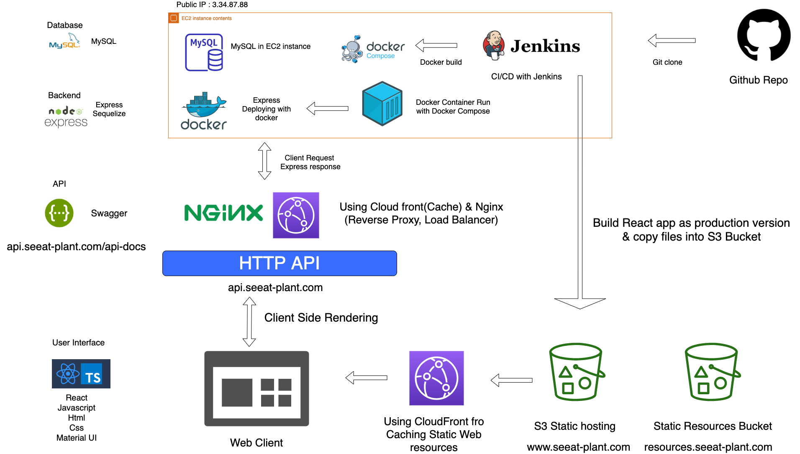

# 🌱 9조

## 🛠 빌드 현황

[](http://3.34.87.77:8080/job/Deploying%20Backend%20-%20express%20REST%20API/)

[](http://3.34.87.77:8080/job/Deploying%20Front-end%20REACT%20APP/)

## 🤓 팀원 소개

| Part     	| GitHub                                   	|
|----------	|------------------------------------------	|
| Backend  	| [김세환](https://github.com/kimsehwan96) 	|
| Backend  	| [주창륜](https://github.com/geneaky)     	|
| Frontend 	| [최소현](https://github.com/choisohyun)  	|
| Frontend 	| [천승아](https://github.com/1000peach)   	|
| Design   	| [장아형]()                               	|
| Design   	| [김희재](https://www.behance.net/reckshu11a868/projects)                               	|

## 🌟 커밋 메시지 컨벤션

- [Git - Commit Message Convention](https://doublesprogramming.tistory.com/256) 블로그 글 참조하여 머리말 달기

## 🐱 Git branch 전략
- 사이드 프로젝트이므로 master 브랜치를 대상으로 기능 브랜치들을 merge 하는 방식으로 진행!

- 브랜치 네이밍 규칙
    - `feature/{front or back}/detail`
    - `bugfix/{front or back}/detail`
    - 예: `feature/front/add-context-api`
    - 예: `bugfix/back/fix-wrong-http-response-code`

### 깃 프로세스

1. `git checkout master`
2. `git pull origin master --rebase`
3. `git branch feature/{front or back}/detail`
4. `git checkout feature/{front or back}/detail`
5. `git add 작업내용`
6. `git commit -m "커밋 메시지"`
7. `git push origin feature/{front or back}/detail`
8. 깃허브에서 Pull Request 생성
9. 리뷰 및 리뷰어의 approve 완료 후 본인이 본인 PR 머지!
10. 머지 이후 브랜치 삭제

- 혹시 더 나은 프로세스가 있을 것 같다면 말씀해주세요! :)

### 💻 디렉토리 구조

- 프론트엔드와 백엔드 디렉토리를 나누어 작업
- resources에는 S3 Bucket에 저장할 어떤 파일들이든저장.
    - 이미지, json, csv 등등 어떤 파일이든 저장 가능

```
.
├── backend
│   └── ...
├── frontend
│   └── ...
├── resources
│   └── ...
└── readme.md
```

### 기술스택 & 아키텍쳐

